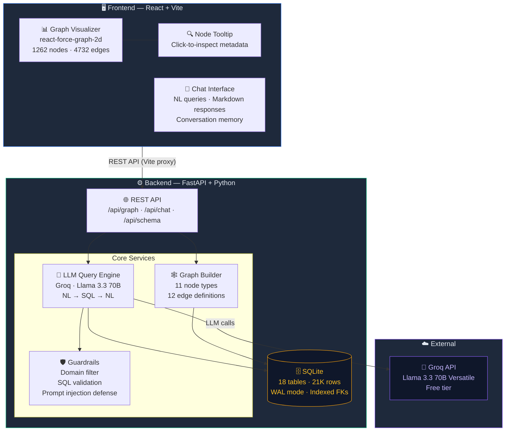

# GBDM Query System — Graph-Based Data Modeling & Query System


A full-stack application that models SAP Order-to-Cash (O2C) data as an interactive graph and enables natural language querying via LLM.


## 🏗️ Architecture



## 📊 Graph Model

**Nodes (1,262 total):**
| Type | Count | Description |
|:---|---:|:---|
| Customer | 8 | Business partners |
| SalesOrder | 100 | Purchase orders |
| SalesOrderItem | 167 | Line items in orders |
| Delivery | 86 | Outbound deliveries |
| DeliveryItem | 137 | Items shipped |
| BillingDocument | 163 | Invoices |
| BillingDocumentItem | 245 | Invoice line items |
| JournalEntry | 123 | Accounting entries |
| Payment | 120 | Customer payments |
| Product | 69 | Materials/goods |
| Plant | 44 | Warehouses/factories |

**Edges (4,732 total):**
- Customer → SalesOrder (PLACED_ORDER)
- SalesOrder → SalesOrderItem (HAS_ITEM)
- SalesOrderItem → Product (CONTAINS_PRODUCT)
- SalesOrder → Delivery (FULFILLED_BY)
- Delivery → DeliveryItem (DELIVERY_HAS_ITEM)
- DeliveryItem → Plant (SHIPPED_FROM)
- Delivery → BillingDocument (BILLED_FOR)
- BillingDocument → BillingDocumentItem (BILLING_HAS_ITEM)
- BillingDocument → JournalEntry (POSTED_TO)
- JournalEntry → Payment (CLEARED_BY)
- Customer → BillingDocument (BILLED_TO)
- Product → Plant (PRODUCED_AT)

## 🧠 LLM Integration & Prompting Strategy

**Provider:** Groq (Llama 3.3 70B Versatile, free tier)

**Two-pass approach:**
1. **NL → SQL:** System prompt includes full database schema with table descriptions, column names, data types, FK relationships, and domain notes. The LLM generates a SQL SELECT query.
2. **Results → NL:** The SQL results are sent back to the LLM with the original question to generate a concise natural language answer.

**Schema Context:** The system prompt includes ~150 lines of structured schema information including:
- Table names, columns, and row counts
- FK relationships and join conditions
- Domain-specific notes (cancelled billings, incomplete flows, INR currency)

## 🛡️ Guardrails

1. **Domain Relevance Filter** — Checks if query contains O2C domain keywords or data-oriented patterns. Rejects off-topic questions (weather, recipes, general knowledge).
2. **Prompt Injection Detection** — Strips patterns like "ignore previous instructions", "you are now", system prompt overrides.
3. **SQL Validation** — Only allows SELECT/WITH statements. Blocks DROP, DELETE, INSERT, UPDATE, ALTER. Blocks system table access and SQL comments.
4. **Execution Safety** — Results capped at 50 rows. Read-only database connection.

## 🗄️ Database Choice

**SQLite** was chosen over Neo4j/graph DBs because:
- Dataset is small (~21K records) — no need for distributed graph processing
- All relationships can be efficiently modeled via SQL JOINs with proper indexes
- Zero setup — no Docker, no server process, just a file
- The graph visualization is constructed from SQL queries, not stored natively as a graph
- Simpler deployment for the demo requirement

## 🚀 Quick Start

### Prerequisites
- Python 3.10+
- Node.js 18+
- Groq API key (free at https://console.groq.com)

### Setup

```bash
# 1. Install backend dependencies
cd backend
pip install -r requirements.txt

# 2. Set your Groq API key
echo "GROQ_API_KEY=your_key_here" > .env

# 3. Ingest data into SQLite
python ingest.py

# 4. Start backend server
python -m uvicorn main:app --host 0.0.0.0 --port 8000

# 5. In a new terminal, install frontend
cd frontend
npm install

# 6. Start frontend dev server
npm run dev
```

Open http://localhost:5173 to use the app.

## 📝 Example Queries

1. **"Which products are associated with the highest number of billing documents?"**
2. **"Trace the full flow of sales order 740506"**
3. **"Find sales orders with incomplete flows"**
4. **"What is the total billing amount per customer?"**
5. **"Show cancelled billing documents"**
6. **"Which plants handle the most deliveries?"**

## 📁 Project Structure

```
GBDM-QUERY_SYSTEM/
├── backend/
│   ├── main.py              # FastAPI application
│   ├── database.py           # SQLite connection & schema
│   ├── ingest.py             # JSONL → SQLite ingestion
│   ├── o2c_data.db           # SQLite database (generated)
│   ├── requirements.txt      # Python dependencies
│   ├── .env                  # Groq API key
│   ├── graph/
│   │   └── graph_builder.py  # Graph construction & queries
│   └── llm/
│       ├── query_engine.py   # NL → SQL → NL engine
│       └── guardrails.py     # Domain & SQL validation
├── frontend/
│   ├── src/
│   │   ├── App.jsx           # Main application
│   │   ├── index.css         # Design system
│   │   ├── main.jsx          # Entry point
│   │   └── components/
│   │       ├── GraphViewer.jsx  # Force-directed graph
│   │       ├── ChatPanel.jsx    # Chat interface
│   │       └── NodeTooltip.jsx  # Node metadata card
│   ├── package.json
│   └── vite.config.js
└── sap-o2c-data/             # Source JSONL dataset (19 folders)
```
